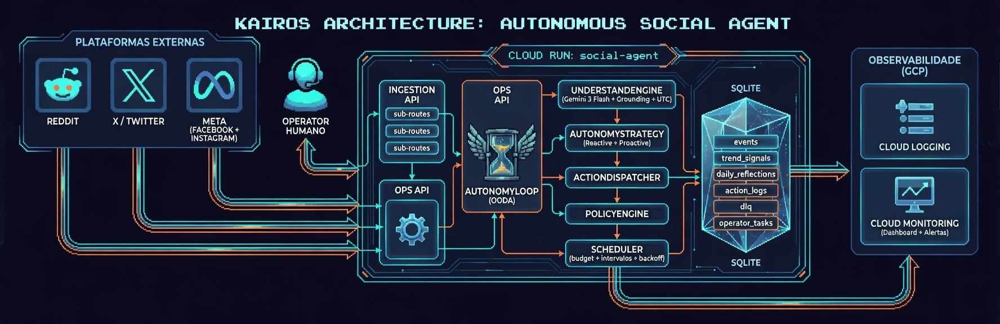
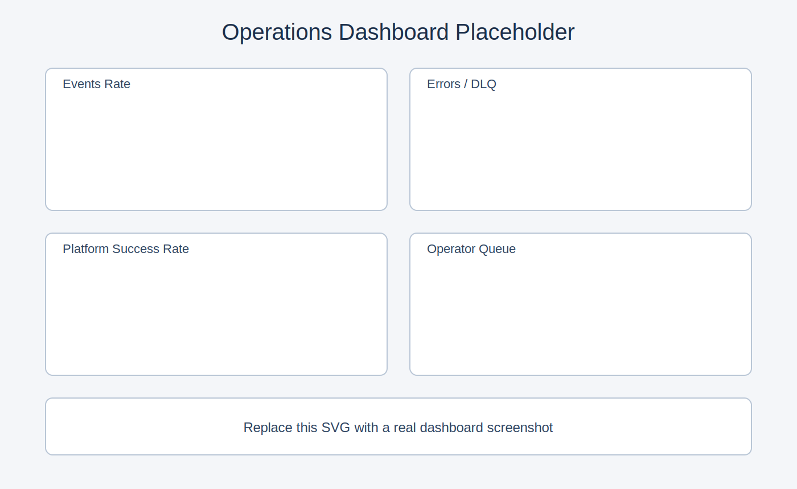

# Social Agent

<p align="center">
  
</p>

<p align="center">
  
  
  
  
  
  
</p>

Agente social autonomo multi-plataforma com ingestao por webhook, loop OODA, estrategia com grounding em Vertex AI e camada operacional para execucao via API ou fila de operador.

Este repositorio e independente de outros servicos no mesmo projeto GCP.

## Visual assets

### Arquitetura


### Dashboard (placeholder)


## O que ja esta implementado

- Ingestao de eventos via `POST /webhooks/reddit`, `POST /webhooks/x` e `POST /webhooks/meta`.
- Verificacao de seguranca:
  - Meta: `X-Hub-Signature-256` (em `production`).
  - X: header `x-social-agent-token`.
  - Meta verify endpoint: `GET /webhooks/meta`.
- Loop autonomo (`AutonomyLoop`) com processamento reativo e ciclo proativo.
- Classificacao e geracao com Gemini (Vertex AI), com:
  - grounding via Google Search (quando habilitado).
  - fallback controlado quando grounding nao retorna metadata.
  - timestamp UTC explicito em todos os prompts.
- Estrategia de 4 perfis (Reddit, X, Facebook, Instagram) com:
  - resposta reativa por urgencia/intencao.
  - publicacao proativa guiada por reflexao diaria + KPIs.
- Autorregulacao de execucao:
  - budget diario por plataforma.
  - cooldown de 30 min apos 3 falhas consecutivas.
- Persistencia operacional em SQLite:
  - fila `events`, `dlq`, `action_logs`, `trend_signals`, `daily_reflections`, `operator_tasks`.
- Modo X sem API paga (`X_EXECUTION_MODE=operator`) com fila operacional.
- Fallback automatico para fila operacional em `reddit/facebook/instagram` quando API falha.
- Endpoints de operacao para status e tratamento da fila de operador.

## Fluxo de execucao

1. Webhook recebe evento e salva em `events`.
2. Loop autonomo pega proximo evento pendente.
3. `UnderstandEngine` classifica contexto (LLM ou heuristica fallback).
4. `AutonomyStrategy` decide resposta/publicacao por plataforma.
5. `ActionDispatcher` aplica budget/scheduler e envia para conector.
6. Se plataforma estiver em modo operador ou fallback, cria `operator_task`.
7. Resultado gera `action_log`; falha persistente vai para `dlq`.
8. Reflexao diaria gera estrategia de 24h para ciclo proativo.

## Matriz por plataforma

| Plataforma | Ingestao | Execucao | Fallback |
| --- | --- | --- | --- |
| Reddit | `/webhooks/reddit` | API Reddit | `operator_tasks` em falha API |
| X | `/webhooks/x` | API X ou `operator` | `operator` nativo sem API paga |
| Facebook | `/webhooks/meta` | Meta Graph API | `operator_tasks` em falha API |
| Instagram | `/webhooks/meta` | Meta Graph API | `operator_tasks` em falha API |

## Endpoints de operacao

- `GET /health`
- `GET /ops/status`
- `GET /ops/operator/tasks?platform=x&status=pending&limit=20`
- `POST /ops/operator/tasks/{task_id}/complete`

## Run local

```bash
python -m venv .venv
source .venv/bin/activate
pip install -r requirements.txt
uvicorn src.app.server:fastapi_app --host 0.0.0.0 --port 8000 --reload
```

## Testes

```bash
# Suite principal
pytest -q

# E2E comportamental do agente
pytest -q tests/test_e2e_agent_behavior.py

# E2E live com Vertex AI
RUN_E2E_LLM_TESTS=1 pytest -q tests/test_e2e_llm.py
```

## Deploy Cloud Run (quick path)

```bash
cp ops/cloudrun/deploy.env.example ops/cloudrun/deploy.env
cp ops/cloudrun/secrets.env.example ops/cloudrun/secrets.env
./ops/cloudrun/bootstrap_gcp.sh ops/cloudrun/deploy.env
./ops/cloudrun/sync_secrets.sh ops/cloudrun/deploy.env ops/cloudrun/secrets.env
./ops/cloudrun/predeploy_check.sh ops/cloudrun/deploy.env
./ops/cloudrun/deploy.sh ops/cloudrun/deploy.env
./ops/observability/setup_observability.sh ops/cloudrun/deploy.env
```

## Documentacao

- Sistema completo (arquitetura/operacao): `SYSTEM_DOCUMENTATION.md`
- Deploy anti-burro: `docs/passo_a_passo_deploy_anti_burro.md`
- Conexao de contas: `docs/conectar_contas_plataformas_anti_burro.md`
- X sem API paga: `docs/x_operacao_sem_api_paga.md`
- Variaveis/env: `docs/deploy_env_vars.md`
- Secrets matrix: `docs/deploy_secrets_matrix.md`
- Dashboard/alertas: `docs/observability_dashboard_spec.md`
- Runbook de incidentes: `docs/runbook_incidentes.md`
- Roadmap implementavel: `docs/roadmap_implantacao_social_agent_cloudrun.md`

## Status de prontidao

- [x] Runtime autonomo multi-plataforma
- [x] Grounding + contexto temporal em prompts
- [x] Operacao com fila de operador e fallback
- [x] Scripts de bootstrap, predeploy, deploy e observabilidade
- [ ] Preencher credenciais reais em `ops/cloudrun/secrets.env`
- [ ] Substituir banner/diagrama/print final da dashboard
